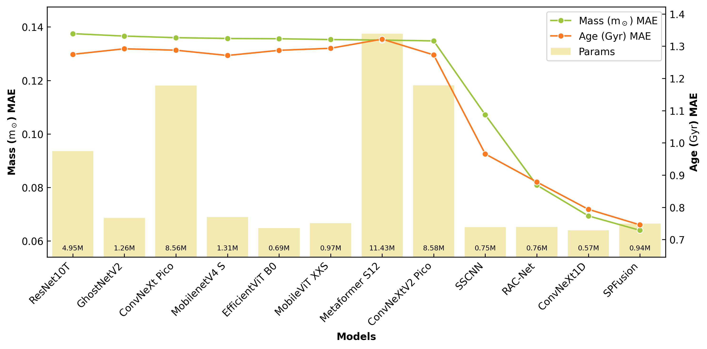

# SPFusion: A Lightweight Multi-Modality Deep Learning Model for Red Clump Stars Parameters Estimation

[](https://github.com/qintianjian-lab/SPFusion/blob/main/paper/SPFusion%20A%20Lightweight%20Multi-Modality%20Deep%20Learning%20Model%20for%20Parameter%20Estimation%20of%20Red%20Clump%20Stars.pdf)




## Environment Preparation

1. Clone the source code from Github

   ```bash
   git clone https://github.com/qintianjian-lab/SPFusion.git
   cd SPFusion
   ```

2. Create Python environment via Conda

   ```bash
   conda create -n spfusion python=3.9
   conda activate spfusion
   ```

3. Install dependencies

   ```bash
   pip install -r requirements.txt
   ```
   
## Configuration

See more configuration in [config/config.py](./config/config.py)

## Pretrained Weights Download

- `.ckpt` format for PyTorch: [weights.ckpt](./weights/weights.ckpt)
- `.onnx` format for ONNX: [model.onnx](./weights/model.onnx)

## Dataset Directory Structure

```
├── DATASET
│   ├── fold 1
│   │   ├── train
│   │   │   ├── spectrum
│   │   │   │   ├── xxx.npy
│   │   │   │   ├── yyy.npy
│   │   │   │   └── ...
│   │   │   ├── photometric
│   │   │   │   ├── xxx.npy
│   │   │   │   ├── yyy.npy
│   │   │   │   └── ...
│   │   │   └── label
│   │   │       └── label.csv
│   │   ├── val
│   │   │   ├── spectrum
│   │   │   │   ├── xxx.npy
│   │   │   │   ├── yyy.npy
│   │   │   │   └── ...
│   │   │   ├── photometric
│   │   │   │   ├── xxx.npy
│   │   │   │   ├── yyy.npy
│   │   │   │   └── ...
│   │   │   └── label
│   │   │       └── label.csv
│   │   └── test
│   │       ├── spectrum
│   │       │   ├── xxx.npy
│   │       │   ├── yyy.npy
│   │       │   └── ...
│   │       ├── photometric
│   │       │   ├── xxx.npy
│   │       │   ├── yyy.npy
│   │       │   └── ...
│   │       └── label
│   │           └── label.csv
│   ├── fold 2
│   │   ├── ...
│   ├── fold 3
│   │   ├── ...
└── ...
```

## Citation

```bibtex
// In prep.
```

